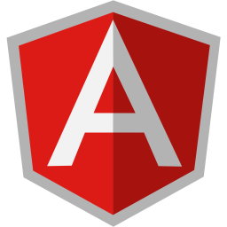
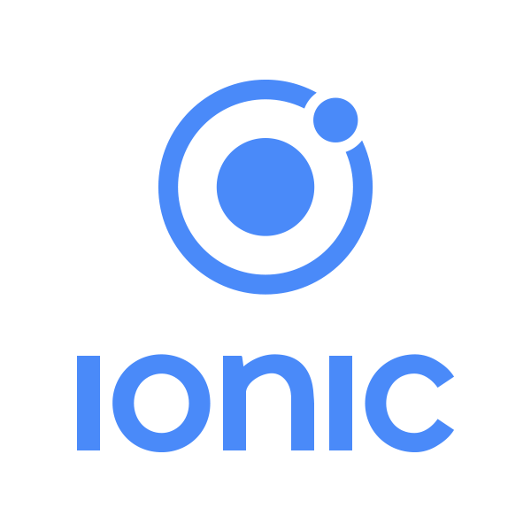
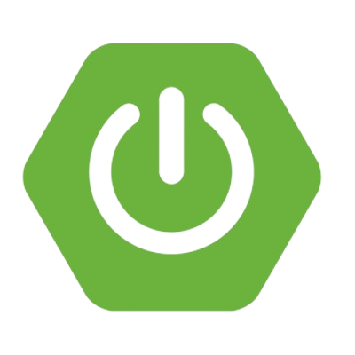
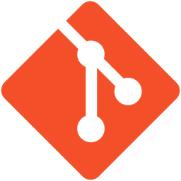
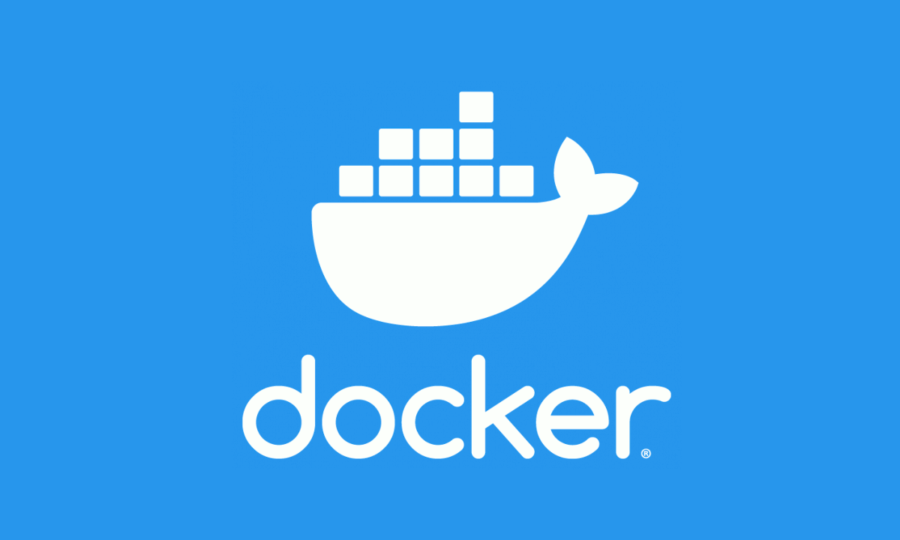

 
 

  

### 
I'm Fernando Ruiz

- 😎 I'm 23 and I'm from Spain.
- 🌱 I’m currently learning more about Web Development.
- 🧐 I'm really interested in Big Data and AI.
- ⚡ I usually develop some bots (Discord, Telegram, Instagram, Whatsapp) as a hobby.
- 😍 I love coding and working as a team.

 

## My Skill Set
<table><tr><td valign="top" width="25%">

### Frontend  

  
    
  
    
   
    
  
  
  
  

</td><td valign="top" width="25%">

### Backend  

  
    
   
  
  
  
  

</td><td valign="top" width="25%">

### DevOps  

  
    
  
    

  
</td><td valign="top" width="25%">

### DataBase

  
    
  
  

</td></tr></table>  

 

## Github Stats

 <Top Langs> 
 
  
 <Wakatime> 
 

 

### Work hard and program smartly!! 😎

